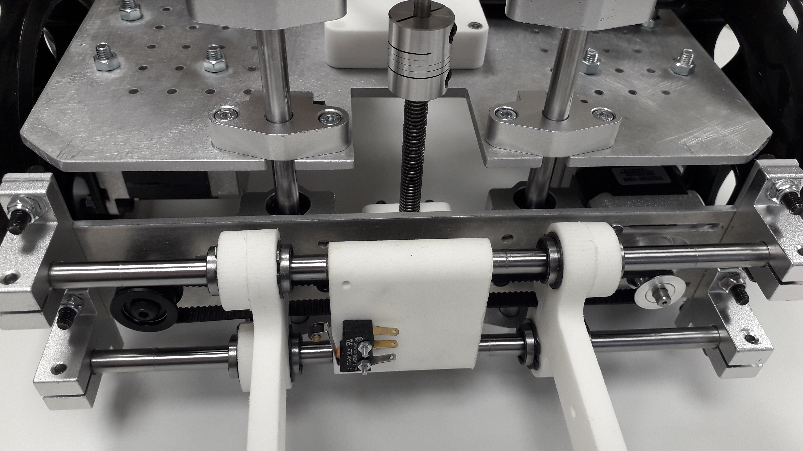
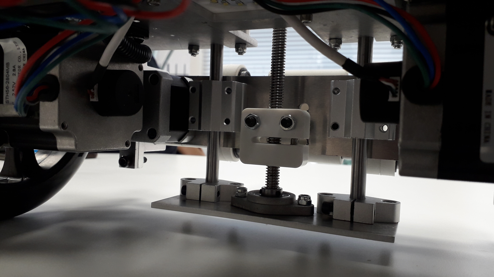
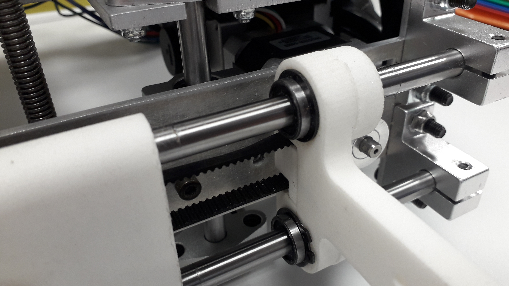
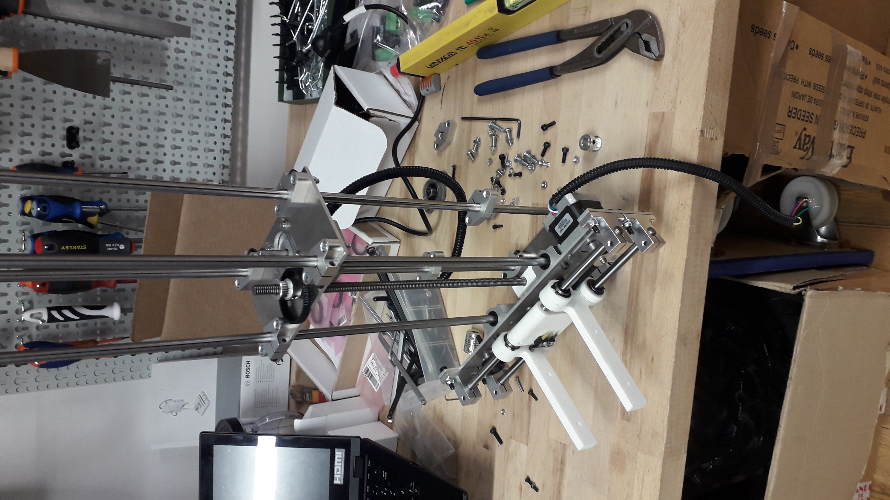

## Preparing your components

Before assembling the RoDeP, be sure having all the required components, they are enumerated in the 
[component list](component.md).

## 1. Assembling the frame

 In order to assemble the frame, you have to gather the following elements :
  

|Number|Component|
|---|---|
|1|frame|
|2|wheel|
|2|wheel motor|
|2|roulette|
|2|battery wedge|

 In the end, you should have something like this :
  

## 2. Assembling the gripping part

 In order to assemble the frame, you have to gather the elements found in the gripping part of the gripper page :   

[component list](gripp.md).

Once you are ready, the assembling process is simple, and once it is done, the gripping part should be like this : 

## 3. Assembling the elevation system

 In order to assemble the final part of the RoDeP, you have to gather the elements found in the second part of the gripper components :
  

 Once this is done, the physical form of the RoDeP should be finished, now is the time for getting the code work ! 

[The code](software.md)