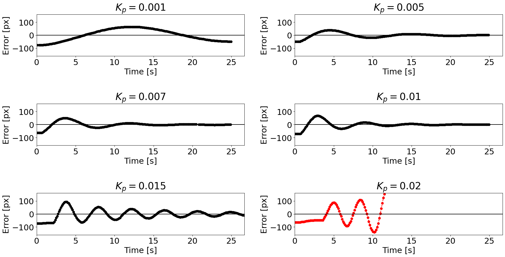

# Controlling the RoDeP

The RoDeP’s controls are coded in Arduino code, but its routines are coded as a state machine, using the StateMachine library from Python, for easier modifications. Here we detail its use, and give some tips about how tuning this code for your use. The main problem being the line following process, we will have a deeper look on its fine tuning. 

## The state machine

The RoDeP state machine has the purpose of being reasonably understandable and tunable. It defines the robot as an object composed of a navigation controller (Arduino with drivers for controlling navigation motors), a gripper controller (Arduino with drivers for controlling the pliers), a camera and other useful parameters, such as masks for image treatment. 
	With this format, the robot goes through 9 states during its mission, two of them being the initial state and final state. When starting the script, make sure to specify the number of plants to be scanned.
	We tried to define those states as intuitive as possible. Here is a diagram outlining its routine :  

Here is the detail of every state :
<ul>
    <li>Initializing : transitory state. At the start of the program, it initialize the serial ports for the Arduino controllers, warm up the camera, prepares the pliers, etc… It also creates, if not already existing, a log-folder that reports the line following error overt time, in case of testing.</li>

   <li>Seeking : the robot follows the green line, looking for the right AprilTag to stop.</li>

   <li>Taking : the robot closes its pliers, lift up the plant, go back a little and make a half-turn.</li>

   <li>Going to scanner : following the green line again, the robot stops at scanner, lifting the plant during its journey.</li>

   <li>Waiting for scan completion : simply waits that the scan is done to start the next state.</li>

   <li>Going to storage : the robot makes a half turn and follows the blue line, stopping at the right tag for the actual plant, the pliers going down in the process.</li>

   <li>Putting down : the robot finish to put down its pliers and then release its grip.</li>

   <li>Going back to scanner : the robot go back a little, makes a half turn and follows the blue line to the scanner. It makes a half turn there, and enter its mission complete state if it has scanned the number of plants specified, otherwise it goes back to the seeking state.</li>
</ul>

Mission complete : the pliers close a last time, and a end-of-mission message is displayed as a notification.  

## Fine tuning the proportional controller

At the moment, the navigation algorithm is controlled using a proportional controller. It suits our actual uses (2 parallel straight lines with 2 turns to the scanner; see figures about the route, average speed of 300 increments per seconds) but can be tuned for your situation, for instance increase the speed. Just keep in mind that the system converges naturally to the “error = 0” state, so adding an integral gain would just slow the system; adding a derivative gain would prove useful for cancelling remaining oscillations, especially if you want to re-design the route to add more curves or increase speed, but if you get high amplitude oscillations, implementing a low-pass filter is advised, in order to cancel high-frequency noise that would be amplified by the derivative.
 
As a reminder, when the camera takes a picture, it crops it to approximately the second quarter (from the top), and we estimate the error as the distance (on the x-axis) between the center of the cropped image and the mean value of the remaining black pixels, after image filtering. 

We then multiply this error value with the proportional gain, and pass the resulting value to a differential drive for the motors :  

As you can see, the speed given in each motor is equal to a certain proportion of the average speed of the wheels, in increments per seconds. 
In order to finetune the proportional gain, we give a set of tests we did in different situations. We tested 6 values in 3 different starting points, and recommend you to use the same starts in order to compare your own plots of error with ours. The graphs we give focus on the error over time regarding the line following algorithm, but beside this quantified quality, it is important to keep an acute eye over two qualitative parameters : first, the orientation of the robot at the end of the test (are the pliers in front of the plant it should be taking ?), and secondly the “empiric oscillations” of the robot. As the error is measured in pixels, oscillations appearing on the graphs might not even be detectable as a human, and therefore can be insignificant. 

### The first set of tests

For our first set of tests, we gave the robot a step of error, and aligned it with the line it is supposed to follow, as shown on the following drawing :  

Testing 6 gains with this initial state gave the following results :  

Only one gain makes the system divergent. The others complete their task with several levels of satisfaction : though not divergent, the lowest gain of 0.001 pixels^-1 is too slow and doesn’t even reach closely the order on a satisfying time, regarding our system. The gain of 0.015 pixels^-1 is also not satisfying, as it oscillates too frequently.  

### The second set of tests

Step of error, unaligned robot : 

With those tests, we evaluate the capacity of the robot to align with the line and the time it takes to do it.  

As expected, the lowest gain tested is too low to prevent the robot from losing the line, and diverges quickly. The gain of 0.015 pixels^-1 is still unsatisfying as the navigation enters in a “pseudo-oscillatory state”, and as the robot is not aligned with the line once it gets to its objective. On the scale of the system, the gain of 0.007 pixels^-1 is a good compromise between converging speed, alignment with the objective and remaining oscillations. 

### The third set of tests

Robot going from the scanner to the first plant. 

With those tests, we evaluate the capacity of the robot at reaching its effective objective in a “real situation”. 

As previously mentioned, the gain of 0.007 pixels^-1 is a good choice since it makes the robot getting to its objective correctly, with a good average time. 

