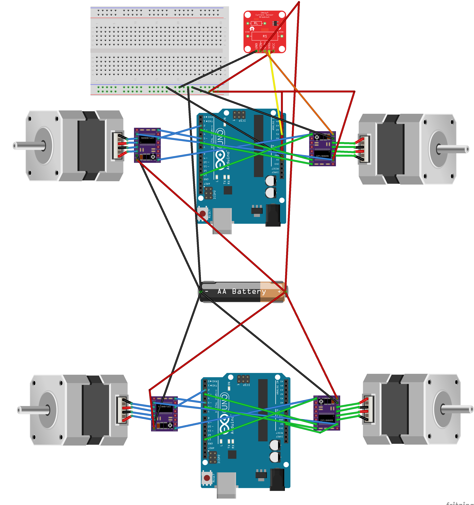

## Electrical diagram

 Here is a diagram representing the principle of the electrical planning.

## Fritzing document

Here is a Fritzing capture, the Fritzing file have to be updated, but you still can study the drivers connection. Available on Github, links found on the first page of this documentation.

## Steppers motors

We choose steppers motors for their high accuracy. Useful for helping the line following algorithm and gripper control. Their consumption is bigger than DC motors, as they need power when not in motion, in order to hold their position.

