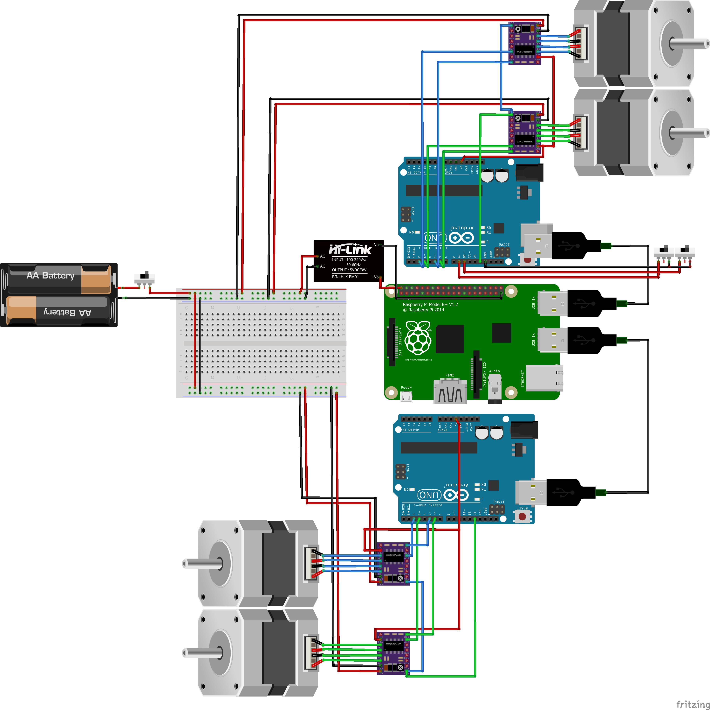

## Electrical diagram

 Here is a diagram representing the principle of the electrical planning.

## Fritzing document

This Fritzing document is avaible [here](https://github.com/Nicobranas/RoDeP-documentation/tree/master/docs/Electronic%20files). On this document, we use one driver per motor, but on the real robot we have chosen to use [gShield V5](https://www.adafruit.com/product/1750), which simplify the diagram. We didn't have represent leds and camera on it, please refere to [this guide](http://www.farnell.com/datasheets/1944095.pdf)

## Steppers motors

We choose steppers motors for their high accuracy. Useful for helping the line following algorithm and gripper control. Their consumption is bigger than DC motors, as they need power when not in motion, in order to hold their position.

