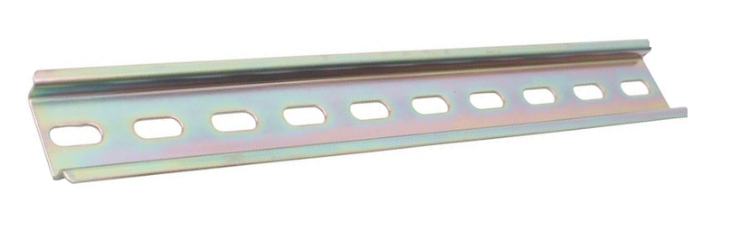
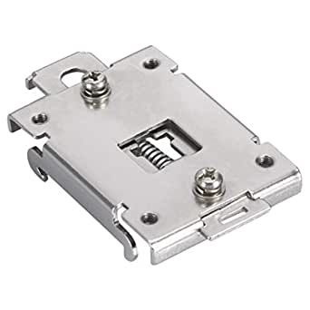

# Rail DIN system

A Rail DIN is a standardized support profile, generally metallic, widely used for the mechanical support of electrical equipment. 
The Rail DIN system allows us to assemble and disassemble easily the differents electronicals components. Moreover, it offers us the possibility of changing the components whithout having to modifie the frame.

## Rail DIN support and adaptator

To fix the different processor and controlor on the Rail DIN we use support, they allow a strong fixation avoiding all parasyte movement.

Then we use homemade adaptator to fix devices. 

