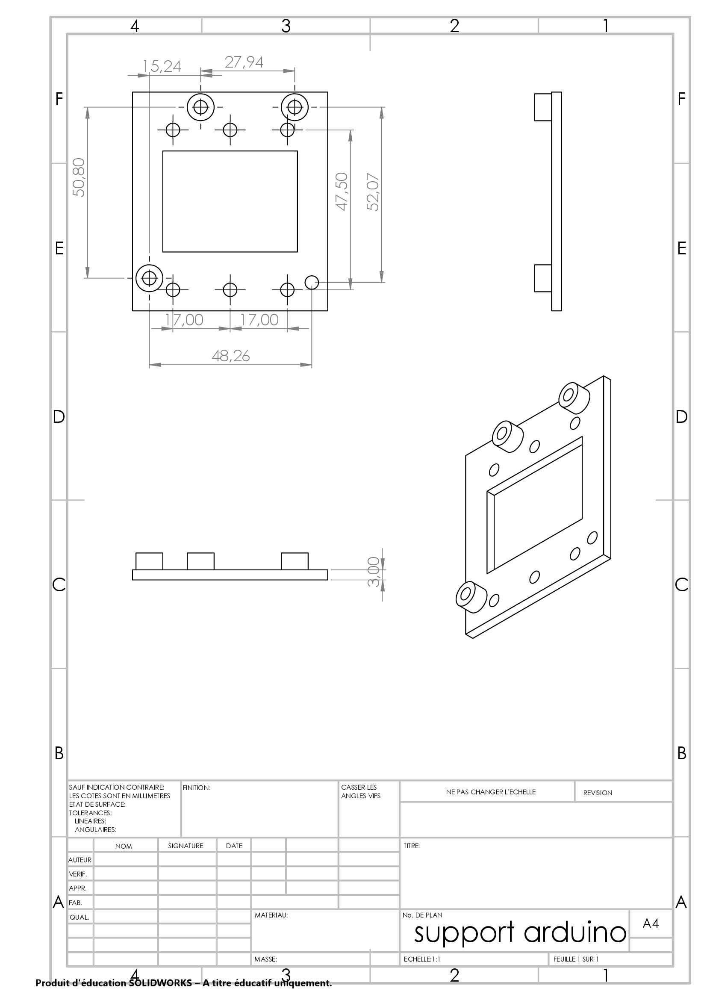
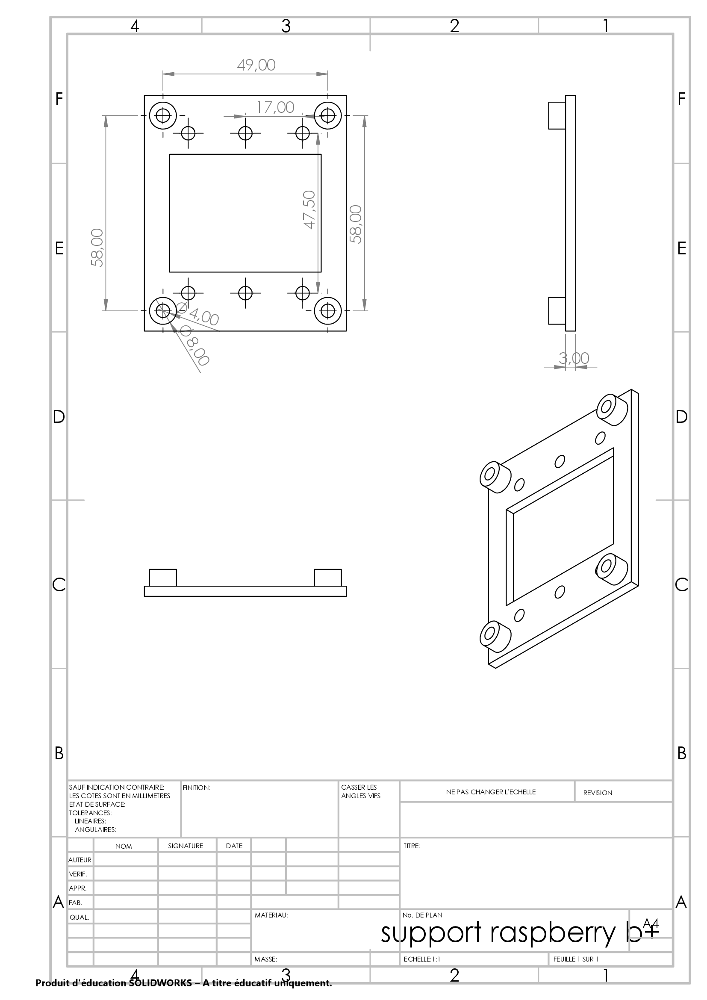
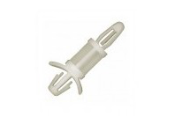

# Rail DIN system

A Rail DIN is a standardized support profile, generally metallic, widely used for the mechanical support of electrical equipment. 
The Rail DIN system allows us to assemble and disassemble easily the differents electronical components. Moreover, it offers us the possibility of changing the components whithout having to modify the frame.

## Rail DIN support and adaptator

To fix the different processors and controller on the Rail DIN we use support, they allow a strong fixation avoiding all parasitic movement.

Then we use homemade plastic adaptator to bind devices and supports.

The assembly is complex, do not tighten the bolts too hard the first time or use : 
[pcb spacer/support](http://www.klip-it.com/50-pcb-spacer-printed-cardboard-support?page=2)

